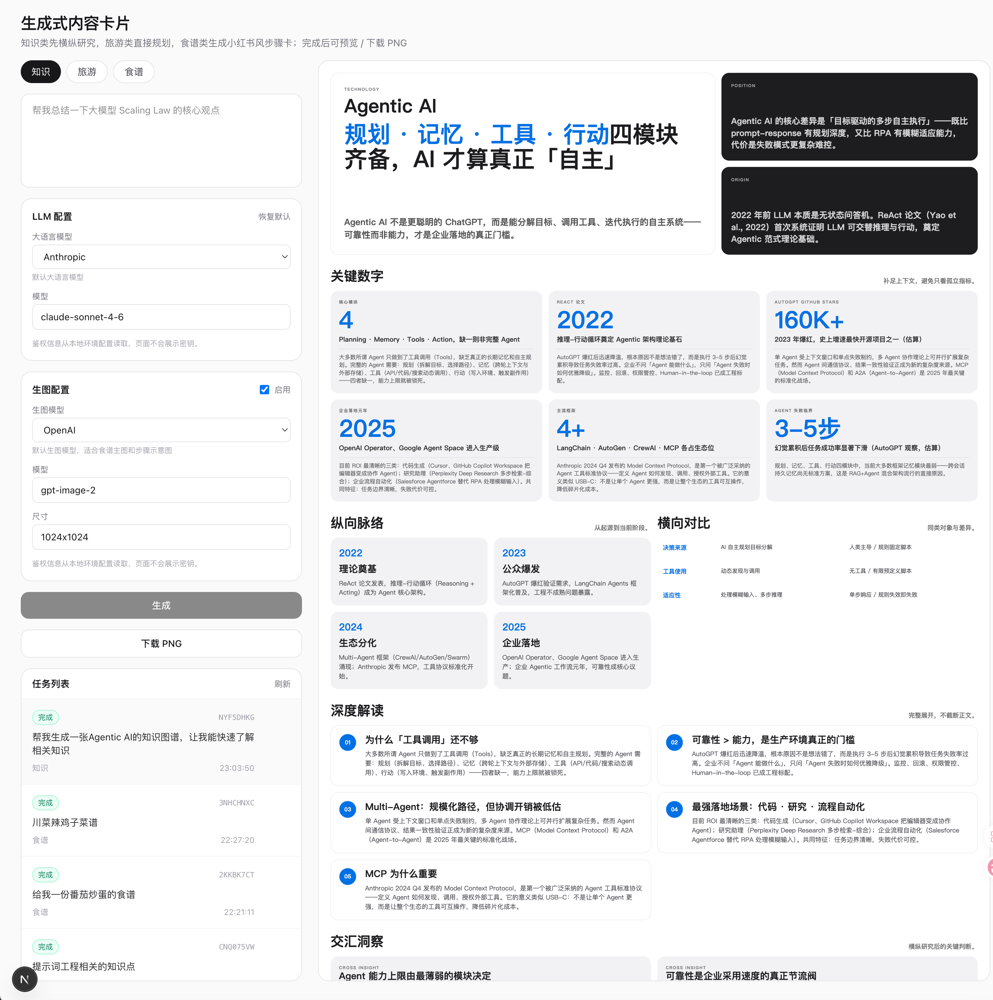
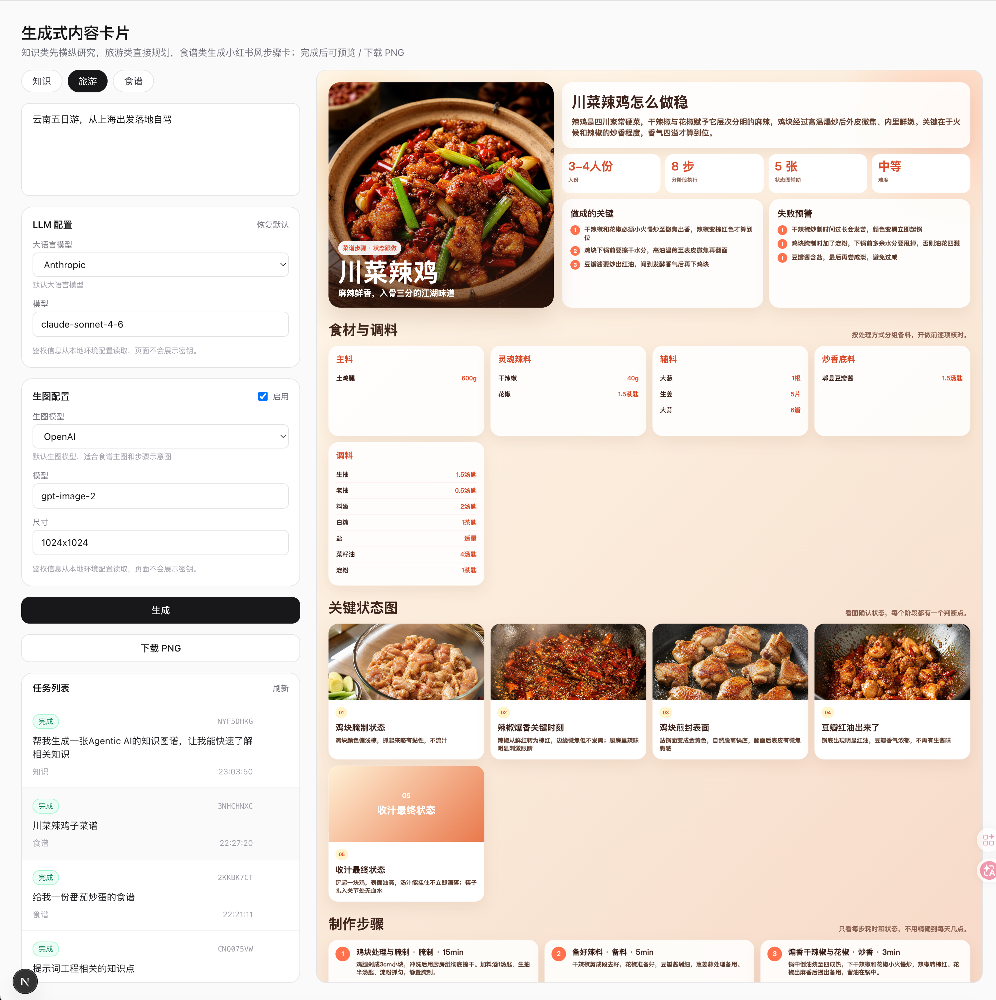

# 生成式内容卡片 / Generative Content Cards

> 中文说明见上半部分，English documentation follows below.

## 项目背景

这是一个 vibe coding 过程中逐步打磨出来的生成式内容卡片项目。最初目标是“一句话生成可发布的一览图”，后来扩展成面向三类内容的卡片生成工具：

- **知识类**：适合概念解释、技术图谱、行业脉络、横向对比和时间线梳理。
- **旅游类**：适合城市短途、自驾路线、多城市行程、住宿和预算规划。
- **食谱类**：适合生成带主图、食材、调料、用量、步骤、过程态检查点的菜谱卡片。

项目现在采用“结构化数据 + 本地稳定模板”的方式生成 HTML 卡片。LLM 主要负责把用户的一句话扩展为结构化 JSON，前端预览和 PNG 导出由本地服务完成。这样比让模型直接写完整 HTML 更稳定，也更容易处理长内容、图片和后续模板迭代。

## 核心能力

- 一句话创建后台生成任务。
- 任务列表支持轮询、预览、下载 PNG、删除记录。
- 支持知识、旅游、食谱三类内容。
- 知识类支持横纵研究、长图自适应高度、开放图库配图和 AI fallback 配图。
- 旅游类支持 1920 宽长图，自驾/多日行程自动展开。
- 食谱类支持菜品主图、步骤图、食材/调料/用量、过程态说明和厨房小白检查点。
- 支持多种大语言模型配置：DeepSeek、OpenAI、Anthropic 兼容链路。
- 支持多种生图模型配置：OpenAI、千问、豆包兼容链路。
- 生成结果保存在本地，便于预览、截图和二次渲染。

## 参考效果图

以下图片来自 `参考/` 目录，用于记录当前项目期望接近的卡片视觉效果。





## 目录结构

```text
.
├── 参考/                # README 展示用参考效果图
├── app/                 # Next.js 应用主体
│   ├── app/             # App Router 页面和 API 路由
│   ├── categories/      # 三类内容的 schema / prompt / meta
│   ├── lib/             # LLM、生图、任务、存储、渲染逻辑
│   ├── scripts/         # 本地调试脚本
│   └── storage/         # 本地生成缓存，已被 git 忽略
├── 知识类/              # 知识类设计 prompt；samples/ 仅本地测试使用
├── 旅游类/              # 旅游类设计 prompt；samples/ 仅本地测试使用
├── 食谱类/              # 食谱类设计 prompt；samples/ 仅本地测试使用
├── docs/                # 开发计划和项目过程记录
└── README.md
```

## 环境要求

- Node.js 20+，推荐使用当前项目已经验证过的 Node 环境。
- pnpm。
- 如需截图导出，需要 Playwright 可用浏览器；项目会优先使用 Playwright 浏览器，也兼容本机 Google Chrome fallback。
- 至少配置一个可用的大语言模型密钥。
- 如需食谱/知识 AI 配图，需要配置至少一个生图模型密钥。

## 安装依赖

```bash
cd app
pnpm install
```

## 配置环境变量

复制示例文件：

```bash
cd app
cp .env.example .env.local
```

`.env.local` 只用于本地运行，已经被 `.gitignore` 忽略，不会上传到 GitHub。

常用配置项：

```bash
# LLM
LLM_PROVIDER=claude-cli
LLM_MODEL_CHAT=claude-sonnet-4-6
ANTHROPIC_AUTH_TOKEN=

# OpenAI-compatible / DeepSeek-compatible
DEEPSEEK_API_KEY=
DEEPSEEK_BASE_URL=https://api.deepseek.com
OPENAI_API_KEY=
LLM_BASE_URL=https://api.openai.com/v1

# Image generation
IMAGE_PACKY_API_KEY=
PACKY_API_KEY=
DASHSCOPE_API_KEY=
IMAGE_QWEN_API_KEY=
IMAGE_DOUBAO_API_KEY=
ARK_API_KEY=

# Snapshot
SNAPSHOT_BASE_URL=http://localhost:3000
```

不要把真实 API Key 写入 README、源码或 prompt 文件。只写入 `.env.local` 或运行环境变量。

## 启动开发服务

```bash
cd app
pnpm dev
```

默认访问：

```text
http://localhost:3000
```

如果你想临时避开 shell 中已有的 Anthropic 相关环境变量，可以使用：

```bash
pnpm dev:clean
```

## 常用命令

```bash
cd app

# 类型检查
pnpm typecheck

# ESLint
pnpm lint

# 类型检查 + lint
pnpm check

# 生产构建
pnpm build

# LLM 简单连通性测试
pnpm llm:smoke
```

## 使用流程

1. 打开首页，输入一句话需求。
2. 选择类目：知识、旅游或食谱。
3. 选择大语言模型和生图模型。
4. 点击生成，任务进入后台队列。
5. 任务完成后可在右侧预览 HTML 卡片。
6. 点击下载 PNG 导出图片。
7. 不需要的任务可在任务列表中删除。

## 本地数据和隐私

生成记录保存到：

```text
app/storage/generations/
```

该目录包含用户输入、结构化 JSON、HTML 和生成图片，默认不纳入 Git。上传 GitHub 前应确认：

- `.env.local` 不在 Git 跟踪列表中。
- `app/storage/` 不在 Git 跟踪列表中。
- `app/.next/` 和 `app/node_modules/` 不在 Git 跟踪列表中。
- 源码、README、prompt、样例中没有真实 API Key。

## GitHub 上传前检查

在上传前建议运行：

```bash
git status --short
git ls-files
git grep -n -E "sk-[A-Za-z0-9]{8,}|(API_KEY|AUTH_TOKEN|PACKY_API_KEY|OPENAI_API_KEY|ANTHROPIC_AUTH_TOKEN|DEEPSEEK_API_KEY|DASHSCOPE_API_KEY|ARK_API_KEY)=[^#[:space:]]+" || true
```

本项目当前要求：**推送 GitHub 前必须先人工确认文件清单和隐私扫描结果**。

---

# Generative Content Cards

## Background

This project is a generative content-card tool built through an iterative vibe-coding workflow. It started as a simple “one sentence to one visual overview” prototype and gradually evolved into a multi-category generator for structured visual cards.

It currently supports:

- **Knowledge cards**: concepts, technical maps, industry timelines, comparisons, and structured explainers.
- **Travel cards**: city trips, road trips, multi-city itineraries, budgets, hotels, and day-by-day plans.
- **Recipe cards**: dish photos, ingredients, seasonings, quantities, cooking steps, process images, and beginner-friendly checkpoints.

The app uses a “structured JSON + deterministic local renderer” architecture. The LLM extracts structured data from the user prompt, while the app renders stable HTML templates locally. This makes the output more reliable than asking the model to write the full HTML every time.

## Features

- Create background generation jobs from one prompt.
- Job list with polling, preview, PNG download, and record deletion.
- Three content categories: knowledge, travel, and recipe.
- Knowledge cards support vertical/horizontal research, auto-height long cards, open-media image search, and AI image fallback.
- Travel cards support 1920px-wide long layouts for multi-day itineraries.
- Recipe cards support hero images, process images, ingredients, seasonings, quantities, cooking steps, and state checkpoints.
- Configurable LLM providers: DeepSeek, OpenAI, and Anthropic-compatible flows.
- Configurable image providers: OpenAI, Qwen, and Doubao-compatible flows.
- Local storage for generation JSON, HTML, and generated/downloaded images.

## Reference Outputs

The following images are stored in `参考/` and document the visual direction this project is aiming for.


## Project Structure

```text
.
├── 参考/                # Reference images shown in README
├── app/                 # Next.js application
│   ├── app/             # App Router pages and API routes
│   ├── categories/      # Schemas, prompts, and metadata
│   ├── lib/             # LLM, image generation, jobs, storage, renderers
│   ├── scripts/         # Local debugging scripts
│   └── storage/         # Local generation cache, ignored by git
├── 知识类/              # Knowledge design prompts; samples/ is local-only
├── 旅游类/              # Travel design prompts; samples/ is local-only
├── 食谱类/              # Recipe design prompts; samples/ is local-only
├── docs/                # Development notes and plans
└── README.md
```

## Requirements

- Node.js 20+.
- pnpm.
- A working LLM API key or compatible local/CLI setup.
- An image-generation key if recipe/knowledge images are needed.
- Playwright or local Chrome for PNG snapshots.

## Install

```bash
cd app
pnpm install
```

## Environment Variables

Create a local environment file:

```bash
cd app
cp .env.example .env.local
```

`.env.local` is ignored by git and must not be committed.

Common variables:

```bash
# LLM
LLM_PROVIDER=claude-cli
LLM_MODEL_CHAT=claude-sonnet-4-6
ANTHROPIC_AUTH_TOKEN=

# OpenAI-compatible / DeepSeek-compatible
DEEPSEEK_API_KEY=
DEEPSEEK_BASE_URL=https://api.deepseek.com
OPENAI_API_KEY=
LLM_BASE_URL=https://api.openai.com/v1

# Image generation
IMAGE_PACKY_API_KEY=
PACKY_API_KEY=
DASHSCOPE_API_KEY=
IMAGE_QWEN_API_KEY=
IMAGE_DOUBAO_API_KEY=
ARK_API_KEY=

# Snapshot
SNAPSHOT_BASE_URL=http://localhost:3000
```

Never put real API keys in README files, source code, prompts, or samples. Keep them in `.env.local` or deployment environment variables only.

## Start the Dev Server

```bash
cd app
pnpm dev
```

Open:

```text
http://localhost:3000
```

To temporarily ignore Anthropic-related shell variables:

```bash
pnpm dev:clean
```

## Useful Commands

```bash
cd app

pnpm typecheck
pnpm lint
pnpm check
pnpm build
pnpm llm:smoke
```

## How to Use

1. Open the app.
2. Enter a one-sentence request.
3. Choose a category: knowledge, travel, or recipe.
4. Choose LLM and image models.
5. Generate a background job.
6. Preview the finished HTML card.
7. Export a PNG snapshot.
8. Delete records you no longer need.

## Local Data and Privacy

Generated records are stored under:

```text
app/storage/generations/
```

This folder may contain user inputs, structured JSON, generated HTML, and images. It is ignored by git.

Before publishing to GitHub, verify:

- `.env.local` is not tracked.
- `app/storage/` is not tracked.
- `app/.next/` and `app/node_modules/` are not tracked.
- No real API keys appear in code, prompts, samples, or documentation.

## Pre-push Checklist

Run:

```bash
git status --short
git ls-files
git grep -n -E "sk-[A-Za-z0-9]{8,}|(API_KEY|AUTH_TOKEN|PACKY_API_KEY|OPENAI_API_KEY|ANTHROPIC_AUTH_TOKEN|DEEPSEEK_API_KEY|DASHSCOPE_API_KEY|ARK_API_KEY)=[^#[:space:]]+" || true
```

This project should only be pushed to GitHub after the file list and privacy scan are manually confirmed.
